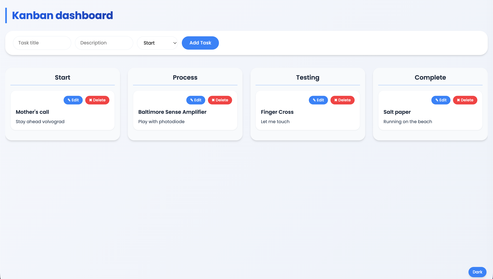

# Kanban

To solve this, I used two global event listeners, one SQLite DB, and an HTTP server using Bun.

Main role: Drag and drop by passing dragState of card to interchange the column of TaskBoard.

Other helper:
- Edit and delete popup
- HTTP API (create, update, patch, delete)

```bash
git clone https://github.com/cureerel/kanban.git && cd kanban && bun install && bun dev
````



I think this is the Kanban.


